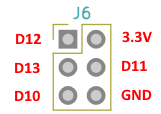
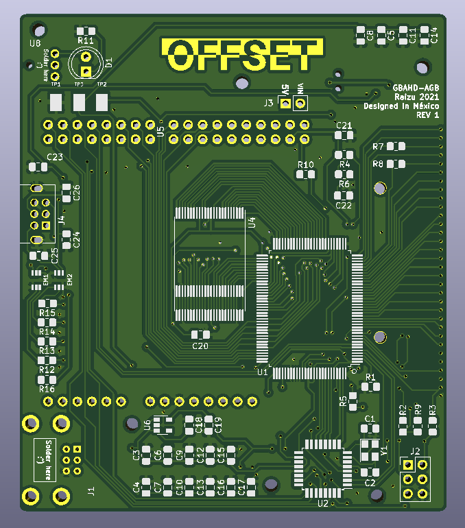

# gbaHD Shield
This is a replacement motherboard for a AGB-CPU for the [gbaHD project](https://github.com/zwenergy/gbaHD).  
- The aim is to remove the CPU and RAM from an original AGB motherboard and place them in this new board.  
- Uses an MCU to connect a classic controller.  
- Has a cartridge slot with a switch to detect DMG/CGB games and switch voltages.
- Has a power switch circuitry to replace Spartan Edge switch.

## Issues
- NOT TESTED YET
- Cart sensor switch might need to be changed
- Cart sensor switch footprint might be wrong.
- Clock might need to be rerouted.
- Link port might need to be rerouted
- No 3D printed case (yet)

## Contributing
I am **NOT** an electrical engineer. Take this as a hobby project from a software engineer's attempt at something cool. If you wish to contribute, see something wrong or want to add a feature please make a pull request or leave an issue!

## BOM
Add this later...

## Programming the MCU
**FIRMWARE NOT YET WRITTEN** (following instructions still work)

In order to program the MCU, you need an arduino to use as ISP.  
Use the following image to wire up an arduino to the board to program it.  
**I would also recomend not programming it while seated in the FPGA board.**
  
After wiring the board, follow this tutorial to flash the bootloader and the sketch to the board.  
[ICSP Tutorial](https://www.arduino.cc/en/pmwiki.php?n=Tutorial/ArduinoISP)  
  
The Arduino code requires the [NintendoExtensionCtrl](https://github.com/dmadison/NintendoExtensionCtrl) library.

## Images

## LICENSE
This documentation describes Open Hardware and is licensed under the CERN OHL v. 1.2.
You may redistribute and modify this documentation under the terms of the CERN OHL v.1.2. (http://ohwr.org/cernohl). This documentation is distributed WITHOUT ANY EXPRESS OR IMPLIED WARRANTY, INCLUDING OF MERCHANTABILITY, SATISFACTORY QUALITY AND FITNESS FOR A PARTICULAR PURPOSE. Please see the CERN OHL v.1.2 for applicable conditions.
